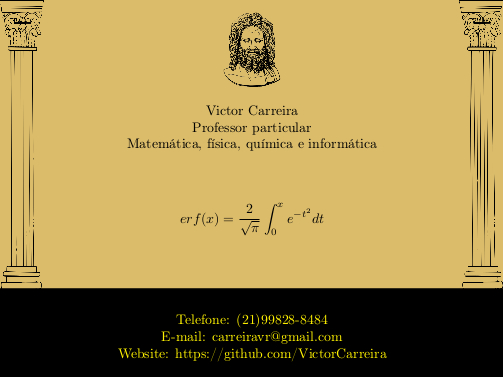

# [Aulas Particulares]()

  

## Referências on-line:

- [Métodos de estudo](https://guiadoestudante.abril.com.br/universidades/descubra-os-10-melhores-metodos-de-estudo-para-se-preparar-para-o-vestibular-e-enem/#)
- [Literatura do ensino médio](http://brasilescola.uol.com.br/)
- [Exercícios resolvidos](https://www.infoescola.com/exercicios/)

### Criador

**Victor Ribeiro Carreira**

- [Curriculum lattes](http://lattes.cnpq.br/9663791782095105)

## Licença

Copyright (c) 2017 Victor Carreira.
